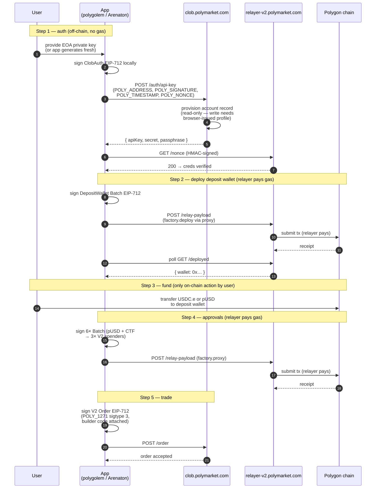

# Builder API Key — Headless Issuance

> **Status:** Empirically verified 2026-05-07 against production.
> **Supersedes:** `docs/BUILDER-CREDENTIAL-ISSUANCE.md` (which claimed curl-only issuance was impossible — that conclusion was wrong).

## Three Credential Types — No Longer Conflated

Polygolem interacts with three distinct Polymarket credential systems. They are not the same thing.

| Credential | Endpoint | Auth Required | Headless? | Used For |
|-----------|----------|--------------|-----------|----------|
| **CLOB L2 Trading Key** | `POST /auth/api-key` | L1 EIP-712 (EOA signs) | ✅ Yes — `builder auto` | Order placement, balance queries, trade history |
| **Builder Fee Key** | `POST /auth/builder-api-key` | L2 HMAC (existing L2 creds) | ✅ Yes — `CreateBuilderFeeKey` | V2 order `builder` field attribution |
| **Relayer API Key** | `POST /relayer/api/auth` | Cookie (Gamma session) | ❌ Browser-gated | WALLET-CREATE, WALLET batch, relayer operations |

### Builder Fee Key (headless, new)

`POST /auth/builder-api-key` at `clob.polymarket.com` takes L2 HMAC headers (from existing CLOB L2 creds) and returns a builder fee key. This key goes in the V2 order `builder` field for attribution. Fully headless — no cookie, no browser.

```go
// After obtaining L2 creds via builder auto or CreateOrDeriveAPIKey:
feeKey, err := client.CreateBuilderFeeKey(ctx, privateKey)
// feeKey.Key → used as builderCode in V2 order struct
```

This is distinct from the Relayer API Key which gates `/relayer/api/auth` behind a cookie from `/login/internal`.

### Relayer API Key (cookie-gated)

The relayer's `/relayer/api/auth` endpoint requires a Gamma session cookie — obtained through a browser-mediated wallet challenge at `/login/internal`. This is the true gate: Relayer API Key issuance cannot be fully automated without characterizing the `/login/internal` flow (SIWE-style vs CSRF + fingerprinting). See [Sub-investigation: /login/internal](#logininternal-sub-investigation).

## Empirical proof

Brand-new EOA `0xA02DBaa282D42d9A5496B6643373D8Db96eFEa64`, generated locally from OS entropy, never touched polymarket.com prior to the call:

```
$ POLYMARKET_PRIVATE_KEY=0x… polygolem builder auto
Signing ClobAuth and creating builder API key via https://clob.polymarket.com...
✓ Received creds (key=64f6a5fb-3ec0-569b-5329-3c8483853f19)
✓ HMAC-signed test request to relayer succeeded
✓ Wrote credentials to /tmp/throwaway-env.builder (mode 0600)
```

The same call ran twice returned the same key — `/auth/api-key` is idempotent per EOA.

## Production V2 reality check (2026-05-07)

**Sigtype 3 (deposit wallet) is the only signature type accepted by `/order` in production.** The 2026-04-28 V2 cutover finished off sigtypes 0/1/2 (EOA / proxy / safe). The CLOB rejects them at the maker-address check before any balance or signing validation runs.

Verified live against `clob.polymarket.com` from a profiled, builder-registered EOA on an open, accepting-orders market (`0x0b4cc3b7…d134bee`, 5-share buy at $0.01):

```
--signature-type eoa|proxy|safe → HTTP 400 maker address not allowed, please use the deposit wallet flow
--signature-type deposit        → HTTP 400 the order signer address has to be the address of the API KEY
```

So the only working path is sigtype 3, and sigtype 3 has its own coupling: **the L2 API key has to be owned by the deposit-wallet address, not the EOA.** Calling `clob create-api-key` with `POLYMARKET_PRIVATE_KEY` mints a key owned by the EOA — that key signs valid HMAC headers, but `/order` rejects it because the order signer (the deposit wallet via ERC-1271) does not match the API-key owner (the EOA).

The well-formed end-to-end path is therefore:

1. Mint Builder API Keys (manual browser click — see below).
2. Deploy the deposit wallet via `relayer-v2/submit`.
3. Mint a CLOB API key **owned by the deposit wallet**, not the EOA.
4. Submit orders signed by the deposit wallet (sigtype 3).

## Two distinct cred types

Polymarket has split write credentials into two pots, and only one of them is mintable headlessly:

| Cred | What it authenticates | How to mint | `polygolem builder auto`? |
| --- | --- | --- | --- |
| **CLOB L2 creds** (`apiKey` / `secret` / `passphrase`) | Reads on `clob.polymarket.com` and `relayer-v2.polymarket.com` (book, balances, /nonce, /deployed). Order placement when API-key owner == order signer. | `POST /auth/api-key` (ClobAuth EIP-712) | ✅ headless |
| **Builder API Keys** | `relayer-v2/submit` writes — `WALLET-CREATE`, `WALLET` batches, deposit-wallet deploy, V2 approval bundles, on-order builder attribution. | Manual browser flow at `polymarket.com/settings?tab=builder` → "Create" | ❌ browser only |

The two are NOT the same triple. A profiled EOA that has registered a builder code but never clicked "Create" under **Builder Keys** will see `relayer-v2/submit` return `HTTP 401 invalid authorization` even with valid CLOB L2 creds. Verified live on `0x33e4aD5A1367fbf7004c637F628A5b78c44Fa76C` 2026-05-07.

## Full onboarding sequence

The minimum the user provides end-to-end is **(1) an EOA private key**, **(2) one click on `polymarket.com/settings?tab=builder` to mint Builder API Keys**, and **(3) one USDC/pUSD transfer**. Everything else — CLOB L2 creds, deposit-wallet deploy, V2 approvals — happens via signatures the app generates locally and HTTP calls the app makes on the user's behalf. The deploy and approval transactions are paid by the Polymarket relayer; only the funding transfer comes from the user.

> The browser click in step 2 is the gate that the rest of polygolem cannot work around. Once the user has Builder API Keys, the remaining flow is fully automated — but until then, `deposit-wallet deploy` will return `HTTP 401 invalid authorization` from the relayer.



**User-facing total cost:** one private key + one funding tx. Zero browser interaction.

## Wire format

### Request

`POST https://clob.polymarket.com/auth/api-key`

Headers (all required):

| Header | Value |
| --- | --- |
| `POLY_ADDRESS` | EOA address, hex with `0x` prefix |
| `POLY_TIMESTAMP` | Unix seconds, decimal string |
| `POLY_NONCE` | Decimal string (use `0`) |
| `POLY_SIGNATURE` | Hex `0x…` 65-byte ECDSA over the EIP-712 hash below |

EIP-712 typed data:

```
domain:  { name: "ClobAuthDomain", version: "1", chainId: 137 }
type:    ClobAuth(address address, string timestamp, uint256 nonce, string message)
value:   { address:   <EOA>,
           timestamp: <unix_seconds_as_string>,
           nonce:     0,
           message:   "This message attests that I control the given wallet" }
```

Signed digest = `keccak256(0x1901 || keccak256(domainSep) || keccak256(structHash))` — standard EIP-712.

### Response

```json
{ "apiKey": "<uuid-shape>", "secret": "<base64>", "passphrase": "<random>" }
```

Some legacy responses use `api_key`, `passPhrase`, or `pass_phrase` — `internal/clob/client.go` accepts all variants.

The `apiKey` value is **UUID-shaped (8-4-4-4-12 hex)** but does **not** conform to RFC 4122 version constraints. Observed values include version-nibbles `1` (existing accounts) and `e` or `5` (fresh accounts). Validators that require a `4` are wrong.

The endpoint also has a `GET /auth/derive-api-key` companion that returns the same triple deterministically when one already exists; `CreateOrDeriveAPIKey` in `internal/clob/client.go` falls back to it on conflict.

## What the backend does on first contact

A new EOA's first signed `POST /auth/api-key` issues an HMAC triple
(`apiKey` / `secret` / `passphrase`). The endpoint is idempotent per EOA.

**Read access** — those creds authenticate against the relayer for read
endpoints (`GET /nonce`, `GET /deployed`). HMAC verifies on the server
side; the EOA can poll its own nonce and deployment status.

**Relayer writes — gated on Builder API Keys.** The relayer's
`POST /submit` endpoint (used for `WALLET-CREATE`, `WALLET` batches)
returns `HTTP 401 invalid authorization` for any EOA whose triple was
issued by `/auth/api-key` rather than by the browser-side **Builder
Keys** issuer. Verified 2026-05-07:

- Throwaway EOA `0xf76Ca737f9c768fc3562fbFbF8A748A4718f2a61` (no
  browser interaction): builder-auto succeeded, `/nonce` + `/deployed`
  200, `/submit` 401.
- Profiled EOA `0x33e4aD5A1367fbf7004c637F628A5b78c44Fa76C` (registered
  builder code, builder enabled, **no Builder Keys minted**):
  same result — `/submit` 401.

The settings page makes the distinction explicit: "Builder Keys: No
builder API keys yet. Create one to get started." The "Create" button
is what mints relayer-write creds; `/auth/api-key` does not.

**CLOB writes — sigtype 3 only.** `clob.polymarket.com/order` accepts
sigtype 3 (deposit wallet) and nothing else; sigtypes 0/1/2 return
`maker address not allowed, please use the deposit wallet flow`.
Sigtype 3 additionally requires the order signer to match the API-key
owner: since `builder auto` mints a key owned by the EOA, sigtype-3
orders signed by the deposit wallet fail with `the order signer
address has to be the address of the API KEY` until a fresh API key is
minted from the deposit wallet itself.

So the canonical onboarding **today** is:

| Step | Mechanism | Coverage from polygolem |
| --- | --- | --- |
| Mint CLOB L2 creds (read access + signing identity) | `polygolem builder auto` | ✅ headless |
| Authenticate relayer reads (`/nonce`, `/deployed`) | same creds | ✅ headless |
| Mint **Builder API Keys** (relayer-write creds) | `polymarket.com/settings?tab=builder` → "Create" | ❌ browser only |
| Deploy deposit wallet (`WALLET-CREATE` via `/submit`) | `polygolem deposit-wallet deploy` | ✅ headless after Builder Keys exist |
| Approve V2 spenders (6× ERC-20/ERC-1155 approvals) | `polygolem deposit-wallet approve` | ✅ headless |
| Mint a deposit-wallet-owned CLOB API key | (TBD — see below) | not yet wired |
| Place orders (sigtype 3) | `polygolem clob create-order` | ✅ headless after the key swap |

Earlier revisions of this doc claimed the first `/auth/api-key` POST
lazy-created the full builder profile end-to-end. That was over-stated
based on a single observation against an EOA that already had a
manually-created profile and Builder Keys. The corrected behaviour
above is what production enforces today.

## Validation

`polygolem builder auto` validates by HMAC-signing a `GET /nonce` against `https://relayer-v2.polymarket.com` using the freshly-issued creds. Server-side HMAC verification doubles as a profile-existence check — only a registered builder address gets a non-error response. Verified for both pre-existing and brand-new EOAs.

## Implementation pointers

### Public Go SDK (semver-stable)

| Concern | Public path |
| --- | --- |
| `CreateOrDeriveAPIKey` / `DeriveAPIKey` (Step 1) | `pkg/universal.Client` |
| `BalanceAllowance` / `UpdateBalanceAllowance` | `pkg/universal.Client` |
| `CreateLimitOrder` / `CreateMarketOrder` (Step 5) | `pkg/universal.Client` |
| Relayer client (Steps 2 & 4) | `pkg/relayer.New` |
| `BuildApprovalCalls` (Step 4 calldata) | `pkg/relayer.BuildApprovalCalls` |
| `SignWalletBatch` (Step 4 signing) | `pkg/relayer.SignWalletBatch` |

### Internal sources

| Concern | Location |
| --- | --- |
| ClobAuth EIP-712 typed data | `internal/auth/eip712.go` |
| L1 header builder | `internal/auth/l1.go` |
| `CreateOrDeriveAPIKey` HTTP client | `internal/clob/client.go:65` |
| Relayer HTTP client | `internal/relayer/client.go` |
| `polygolem builder auto` CLI | `internal/cli/builder.go` (`newBuilderAutoCommand`) |
| Persisted env file shape | `internal/cli/builder.go:persistBuilderCredentials` |

## Operational notes

- Idempotent: re-running `builder auto` for the same EOA returns the same creds. Use `--force` to overwrite the local env file with re-fetched values.
- `--no-validate` skips the relayer round-trip — useful for offline runs but loses the existence check.
- The throwaway-key proof above generated and discarded the EOA in seconds; the orphan account on Polymarket is harmless.

## End-to-End Cost to the User

| Item | Cost | Who Pays |
|------|------|---------|
| Generate EOA key | Free | N/A |
| CLOB L2 creds (`builder auto`) | Free, headless | N/A |
| **Mint Builder API Keys** (one browser click on `polymarket.com/settings?tab=builder`) | Free, manual | User |
| Wallet deploy | Free (gas sponsored) | Polymarket relayer |
| 6 contract approvals | Free (gas sponsored) | Polymarket relayer |
| Place orders | Free (gas sponsored) | Polymarket relayer |
| **Fund wallet (one tx)** | **~$0.01 POL** | **User** |
| pUSD to trade with | Whatever you deposit | User (your money) |

**Total hard cost to user:** ~$0.01 in POL gas for one transfer plus one browser click to mint Builder API Keys. Everything else is automated.

---

## Flow A — Wallet Already Deployed (Returning User)

When the user returns, skip deploy and approve:

```
┌─────────────────────────────────────────────────────────────────┐
│            RETURNING USER — WALLET ALREADY DEPLOYED              │
│                                                                 │
│  1. App has EOA private key (or MetaMask connected)            │
│  2. Derive wallet address (local CREATE2 — instant)             │
│  3. GET /deployed?address=EOA → { deployed: true }             │
│                                                                 │
│     ✅ Wallet exists — skip deploy                              │
│     ✅ Approvals exist — skip approve                           │
│                                                                 │
│  4. Check balance (CLOB /balance-allowance)                     │
│                                                                 │
│     ┌──────────────────┬──────────────────────┐                 │
│     │  Has pUSD        │  Needs funding        │                 │
│     │  → Trade         │  → Fund first         │                 │
│     └──────────────────┴──────────────────────┘                 │
│                                                                 │
│  5. Trade — build order → sign EIP-712 → POST to CLOB          │
└─────────────────────────────────────────────────────────────────┘
```

```bash
polygolem deposit-wallet status
# {
#   "eoa": "0x...",
#   "deposit_wallet": "0x...",
#   "deployed": true,
#   "approvals": 6,
#   "pUSD_balance": "5.00",
#   "ready_to_trade": true
# }
```

---

## Funding Flow — POL + pUSD → Deposit Wallet

### The Only Two Things the User Needs

| Need | Amount | Purpose |
|------|--------|---------|
| POL (MATIC) | ~0.01 | Gas for ONE ERC-20 transfer (EOA → deposit wallet) |
| pUSD | Whatever you want to trade | Trading collateral |

Everything else is gas-sponsored by the Polymarket relayer. One transaction, paid in POL, gets you funded. After that, zero gas forever.

### The pUSD Pipeline

```
┌─────────────────────────────────────────────────────────────────┐
│                    pUSD FUNDING FLOW                             │
│                                                                 │
│  Step 1: Get POL (~$0.01)                                       │
│    Any exchange → withdraw POL to EOA on Polygon                 │
│    This is the ONLY gas you'll ever pay.                        │
│                                                                 │
│  Step 2: Get pUSD on Polygon                                    │
│    Option A: Polymarket Bridge API (auto-converts USDC → pUSD)  │
│    Option B: Polymarket.com deposit (converts USDC → pUSD)      │
│    Option C: Call CollateralOnramp.deposit(USDC) on-chain       │
│                                                                 │
│  Step 3: Transfer pUSD EOA → Deposit Wallet                     │
│    polygolem deposit-wallet fund --amount X                     │
│    One ERC-20 transfer. That's it. Gas: ~$0.01 POL.             │
│                                                                 │
│  After this: zero POL needed. All trading is gas-sponsored.     │
└─────────────────────────────────────────────────────────────────┘
```

> **pUSD homogeneity strategy:** We commit to pUSD as the settlement token for ALL markets — Polymarket's existing markets AND any future markets built on the Arenaton/Polydart stack. One token, one wallet, one funding pipeline. No bridging, no wrapping, no multi-chain fragmentation.

---

## The Deposit Wallet — Beyond Polymarket

The deposit wallet is an ERC-1967 proxy smart contract on Polygon. It's NOT Polymarket-specific — it's a general-purpose smart contract wallet implementing ERC-1271.

### What the Wallet CAN Do

| Capability | Standard | Polymarket-Specific? |
|-----------|----------|---------------------|
| Hold pUSD | ERC-20 | No — any ERC-20 works |
| Hold USDC, USDC.e | ERC-20 | No |
| Hold POL (native) | Native balance | No |
| Hold outcome tokens | ERC-1155 (CTF) | Yes (CTF-specific) |
| Sign typed data | ERC-1271 (EIP-1271) | No — any protocol can validate |
| Execute batched calls | factory.proxy(batch[], sig[]) | No — general-purpose proxy |
| Approve token spenders | ERC-20 approve via batch | No — any spender |
| Interact with ANY contract | Via proxy batch calls | No — fully programmable |

### ERC-1271 Interoperability

The wallet implements `isValidSignature(bytes32 hash, bytes signature)` per EIP-1271. Any protocol that accepts ERC-1271 signatures can validate EOA-signed messages through this wallet. The wallet itself has no private key — the EOA signs, the wallet validates.

### pUSD-Native Markets — Your Own Prediction Markets

The deposit wallet + pUSD gives you a turnkey settlement layer:

| Capability | Why It Matters |
|-----------|---------------|
| **Single collateral token** | All markets settle in pUSD. No per-market token fragmentation. |
| **One wallet, all markets** | Users fund once, trade on Polymarket AND your custom markets. |
| **ERC-1271 signatures** | EOA signs, deposit wallet validates. No per-market key management. |
| **Batch execution** | Approve + trade in one `factory.proxy()` call. No per-market approval flow. |
| **Same gas model** | Polymarket relayer sponsors gas. Your markets can use the same or similar relayer. |
| **1:1 USDC backing** | pUSD is fully backed on-chain. No algorithmic risk. No peg to maintain. |

### Wallet Interface

```solidity
// Core capabilities of the deposit wallet
interface IDepositWallet {
    // ERC-1271 — any protocol calls this to validate EOA signatures
    function isValidSignature(bytes32 hash, bytes calldata signature) 
        external view returns (bytes4 magicValue);
    function owner() external view returns (address);
}

// Factory — deploy + execute
interface IDepositWalletFactory {
    function proxy(Batch[] batches, bytes[] signatures) external;  // UNGATED
    function predictWalletAddress(address impl, bytes32 id) external view returns (address);
}
```

---

## Polygolem API Surface

| Command | What it does | Gas Cost |
|---------|-------------|----------|
| `polygolem builder auto` | Create builder profile + HMAC creds (ClobAuth EIP-712) | Free |
| `polygolem deposit-wallet derive` | Predict CREATE2 wallet address (local) | Free |
| `polygolem deposit-wallet status` | Check deployed?, approvals?, balance? | Free |
| `polygolem deposit-wallet deploy --wait` | WALLET-CREATE via relayer | Sponsored |
| `polygolem deposit-wallet approve --submit` | 6-call WALLET batch via relayer | Sponsored |
| `polygolem deposit-wallet fund --amount X` | ERC-20 transfer EOA → deposit wallet | ~$0.01 POL |
| `polygolem deposit-wallet onboard --fund-amount X` | deploy + approve + fund (all-in-one) | ~$0.01 POL |
| `polygolem bridge deposit <addr>` | Get EVM/Solana/BTC deposit addresses | Free |
| `polygolem clob create-order ...` | Place order (POLY_1271 signed) | Sponsored |

---

## What the old doc got right and wrong

`docs/BUILDER-CREDENTIAL-ISSUANCE.md` asserted that builder creds are gated behind a Polymarket session cookie and that `/auth/api-key` only issues "CLOB L2" creds (a separate type from "Builder API Keys").

**The two-cred-types observation was correct.** As of the V2 cutover, `/auth/api-key` issues CLOB L2 creds, and Builder API Keys are a distinct triple minted only by the browser flow at `polymarket.com/settings?tab=builder`. See § Two distinct cred types above for the empirical 401 evidence.

**The session-cookie claim was wrong.** The browser's wallet popup signs a standard ClobAuth EIP-712 payload identical to what polygolem signs in `builder auto`. There is no proprietary session-cookie handshake on the wire; the mint is gated by the **frontend's "Create" button calling a different endpoint**, not by anything that strictly needs a browser. A future polygolem revision could reach the same endpoint headlessly once we identify it; until then the manual step stands.

**Bottom line:** `polygolem builder auto` is the headless half of the onboarding flow. Minting Builder API Keys is the manual half, and is currently load-bearing for every relayer-write code path (`deposit-wallet deploy/approve`, on-order builder attribution).
